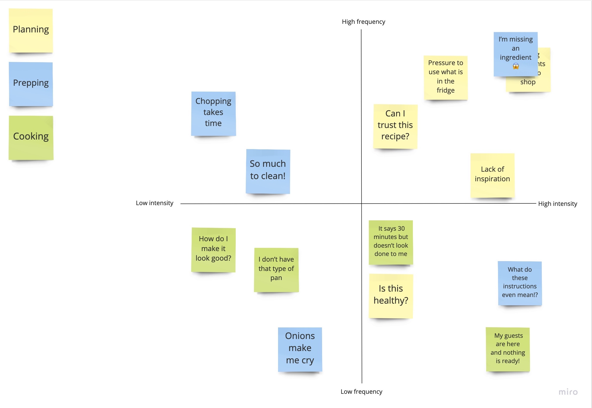
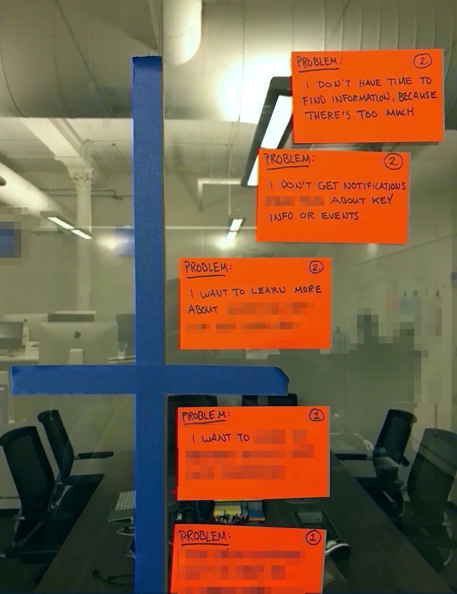

## How to Use this Method

{}
### Sample Agenda & Prompts
1. Gather all the problems you discovered from research

1. If there are many (roughly 20+), first do a culling exercise by asking yourselves "Is this problem related to our goals?"; sort each problem/pain into a "No" or "Yes" pile on the wall.

1. Create a 2x2 with the painter's tape and label the axes as follows:
   - X-Axis --> Low User Pain (left) to High User Pain (right)
   - Y-Axis --> Low Frequency (bottom) to High Frequency (top)

   {}
   Tip: Optionally, you can generate different 2x2 criteria by asking the team "What makes a problem worth solving?". Some other 2x2 examples include: higher user pain vs. higher impact (e.g. affects most users); higher user pain vs. higher business pain (e.g. in terms of lost revenue); higher impact vs. higher immediate need.
   {}
   

1. Plot the problems/pains on the 2x2.  

   

1. Depending upon the size of each problem/pain, strive to end with a list of the top 3-5 problems/pains.

   {}
   Tip: If there are too many priority problems in the top right quadrant, re-draw the axes within that quadrant to further separate the problems. Remember that this is possible because the axes are relative, not absolute. Keep adjusting until you land somewhere manageable.
   {}
{}

{}
### Success/Expected Outcomes
Success is achieved when the team agrees to the top 3-5 problems on which it will focus.
{}

{}
### Facilitator Notes & Tips

The timing of this activity varies along with the number of problems identified in the research process, so prepare accordingly. It can also be beneficial to timebox conversation of each problem in order to ensure the team maintains forward momentum.
{}

{}
### Variations
- [2x2 Prioritization](/practices/2x2)
{}

{}
### Preceding
- [Research Synthesis](/practices/research-synthesis)
{}

{}
### Following
- [Insight Prioritization](/practices/insight-prioritization)
- [Solution Brainstorming](/practices/solution-brainstorming)
{}

{}
### Real World Examples

{}
